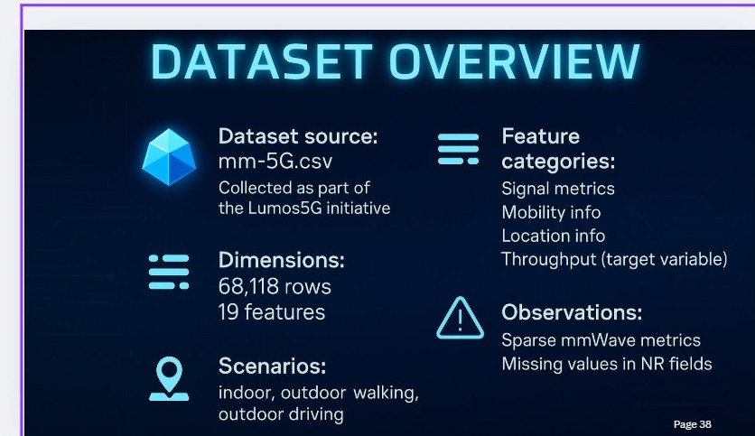
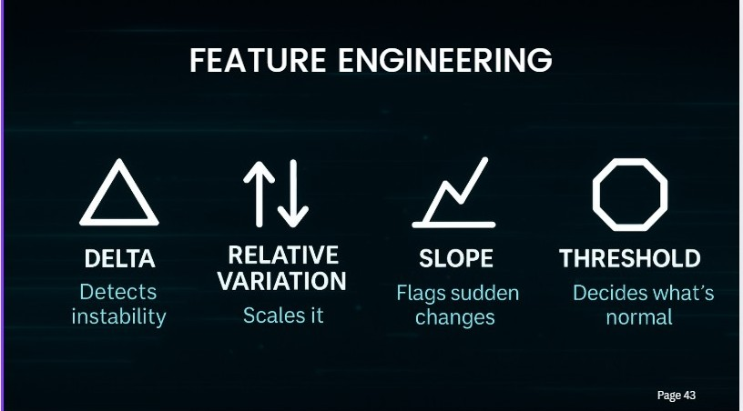
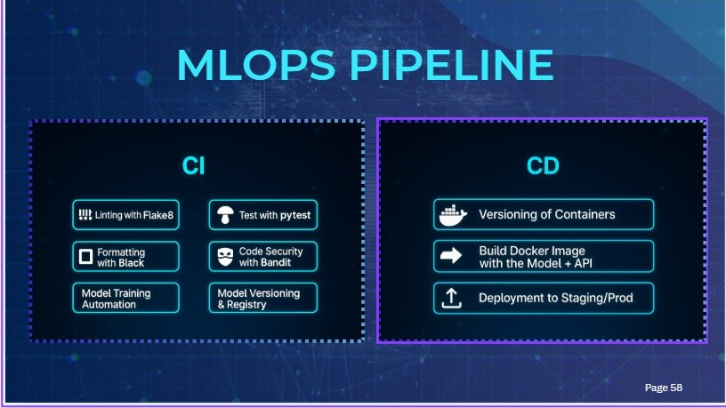
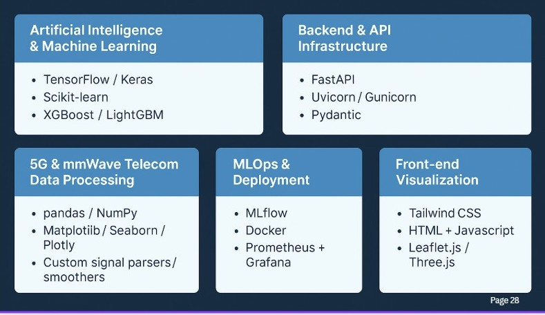
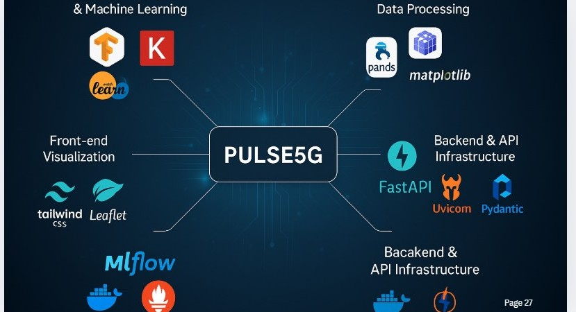

  

**AI-Driven 5G mmWave Throughput Prediction & MLOps Pipeline**

SynergyX is an AI-powered research project focused on **predicting and optimizing 5G mmWave throughput** under dynamic real-world conditions.  
The project combines **data-driven modeling**, **hybrid deep learning architectures**, and a **robust MLOps pipeline** to support reliable, adaptive, and energy-efficient next-generation mobile networks.

---

## 👥 Project Team – SynergyX

- Malek Kateb
- Corinne Tatiana
- Souhyl Guenichi
- Luc Ngoa
- Philippe Nomo

---

## 🎯 Problem Statement

**How can we design an AI-driven 5G mmWave throughput prediction model that adapts in real time to dynamic conditions such as user mobility and indoor/outdoor environments, remains reliable despite incomplete or imbalanced radio data, and enables energy-efficient network optimization aligned with sustainable development goals?**

This problem highlights key challenges of mmWave networks:

- High throughput variability
- Sensitivity to mobility and environment
- Sparse and missing NR signal measurements
- Increasing energy consumption of dense network infrastructures

---

## 📊 Dataset Overview

  

### Observations

- Sparse mmWave (NR) measurements
- Missing values in NR-related fields
- Strong heterogeneity across scenarios

---

## 🔍 Data Understanding

The dataset is structured around **sessions and sequences**, representing temporal user trajectories.

### Key Feature Groups

- **Session & Temporal Context**

  - `run_num`, `seq_num`

- **Location**

  - `latitude`, `longitude`

- **Mobility**

  - `movingSpeed`
  - `compassDirection`
  - `trajectory_direction`
  - `mobility_mode`

- **Radio & Connectivity**
  - `abstractSignalStr`
  - `lte_rssi`, `lte_rsrp`, `lte_rsrq`, `lte_rssnr`
  - `nr_ssRsrp`, `nr_ssRsrq`, `nr_ssSinr`
  - `tower_id`, `nrStatus`

This structure enables **spatio-temporal learning** while capturing both LTE and NR radio behavior.

---

## 🛠️ Data Preparation

Several preprocessing steps were applied to ensure robust modeling:

- **Handling Missing Values**

  - Identification of sparse NR fields
  - Context-aware handling of missing radio metrics

- **Feature Engineering**

  - Separation of raw and smoothed throughput
  - Temporal window construction (rolling windows / snapshots)
    

    
  

- **Data Normalization**

  - Scaling of radio, mobility, and throughput features
  - Stabilization of training dynamics

- **Dataset Split**
  - Train / validation / test split
  - Sequence-aware splitting to avoid data leakage

---

## 🧠 Modeling Strategy

### Explored Approaches

1. **Raw Throughput Prediction**

   - Direct prediction from instantaneous throughput values
   - Captures fast variations but sensitive to noise

2. **Smoothed Throughput Prediction**
   - Uses rolling-window smoothing
   - Improves stability but may lose short-term dynamics

These complementary behaviors motivated a hybrid strategy.

  

---

## 🔀 Hybrid Multitarget Approach

To combine the strengths of both representations, we adopted a **multitarget learning strategy**:

- Simultaneous prediction of:
  - **Raw throughput**
  - **Smoothed throughput**
- Shared spatio-temporal feature representation
- Improved robustness across mobility scenarios

---

## 🏁 Final Model

### **Switched Raw–Smoothed Sliding CNN + LSTM**

The final architecture integrates:

- **CNN layers** for local pattern extraction
- **LSTM layers** for temporal dependency modeling
- A **switching mechanism** that dynamically selects between:
  - raw throughput prediction
  - smoothed throughput prediction

This design allows the model to:

- React to sudden changes (mobility, blockage)
- Preserve stability when conditions are smooth
- Adapt to heterogeneous network contexts

---

## ⚙️ MLOps Pipeline

A complete **CI/CD-oriented MLOps pipeline** was implemented to ensure reproducibility and deployment readiness.

### Continuous Integration (CI)

- Linting with **Flake8**
- Code formatting with **Black**
- Unit testing with **pytest**
- Security analysis with **Bandit**
- Automated model training
- Model versioning & registry

### Continuous Deployment (CD)

- Container versioning
- Docker image build (Model + API)
- Deployment to staging / production environments

This pipeline enables **end-to-end automation**, from data processing to model deployment.

  

## 🐳 Docker Images & Deployment

All SynergyX components are containerized and published on **Docker Hub** to ensure portability, reproducibility, and scalable deployment.

### 📦 Docker Repository

**Docker Hub:**  
👉 https://hub.docker.com/r/philippe545/5g_throughput_prediction

### 🏷️ Available Images & Tags

The repository currently provides the following images:

| Component              | Docker Tag        |
| ---------------------- | ----------------- |
| Frontend               | `frontend-latest` |
| Backend (API + Model)  | `backend-latest`  |
| MLflow Tracking Server | `mlflow-latest`   |

Each image is built and pushed automatically as part of the **CI/CD pipeline**.

### Pulling the Images

docker pull philippe545/5g_throughput_prediction:frontend-latest
docker pull philippe545/5g_throughput_prediction:backend-latest
docker pull philippe545/5g_throughput_prediction:mlflow-latest

###  Technologies used

  

  

## 🌱 Sustainability Perspective

SynergyX contributes to **sustainable network design** by:
- Anticipating throughput degradation instead of reacting to failures
- Enabling proactive resource allocation
- Reducing unnecessary retransmissions and energy waste
- Supporting energy-efficient 5G mmWave operation aligned with SDGs

---

## 📌 Conclusion

SynergyX demonstrates how **AI, hybrid deep learning, and MLOps** can be combined to address the challenges of 5G mmWave networks.
By jointly modeling raw and smoothed throughput and embedding the solution in a robust pipeline, the project delivers a **scalable, adaptive, and sustainable intelligence layer for next-generation mobile networks**.

## 🏆 Awards & Media

### 🥇 First Prize Winner – Bal des Projets

The **SynergyX – mmWave Intelligence** project was awarded the **🥇 First Prize** at the *Bal des Projets*, recognizing its innovation, technical excellence, and impact in the field of **AI-driven 5G mmWave network intelligence**.

This distinction highlights the relevance of our approach in addressing real-world challenges related to **throughput prediction, mobility adaptation, and energy-efficient network optimization**.

---

### 🎥 Project Presentation (YouTube)

Watch the official presentation of **SynergyX**:

  

---

### 🔗 LinkedIn Announcement

Official LinkedIn post announcing the award and project:

👉 https://www.linkedin.com/posts/philippeandre-nomo-36b953350_proud-moment-first-prize-bal-des-projets-activity-7408100467978682368-10t0

